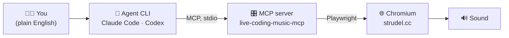

# Strudel MCP — Exploration Week Workshop

Teaching **agent literacy through a creative domain**: you type a request to an AI agent,
and a browser makes music. Built on [Strudel](https://strudel.cc) (live-coding music) and
an MCP server that drives it.

> [!IMPORTANT]
> **Thesis: you cannot direct an AI well in a domain you understand nothing about.**
> So we teach just enough Strudel to read what the agent writes, just enough music
> vocabulary to ask for things, and enough ambitious ideas to know what's possible.
> **MCP is the mechanism, and it is taught — but it is not the subject.** It's what lets
> you point an agent at software you barely know, which is the same lesson as the week's
> Blender station.



## Quick start

**Prerequisite: Node.js 22+** (`npm` and `npx` come bundled — nothing extra to install).

| Platform | Get Node 22+ |
| --- | --- |
| **macOS** | `brew install node@22`, or [nvm](https://github.com/nvm-sh/nvm) (`nvm install 22`), or [nodejs.org](https://nodejs.org) |
| **Windows** | Installer from [nodejs.org](https://nodejs.org), or `winget install OpenJS.NodeJS.LTS` |
| **Linux** | [nvm](https://github.com/nvm-sh/nvm), or your distro's package manager |

Check: `node -v` → must be **v22+** (upgrade first if older).

```bash
# 1. Install the MCP server + the browser it drives (once per machine)
npm install -g @williamzujkowski/live-coding-music-mcp@4.0.0
node "$(npm root -g)/@williamzujkowski/live-coding-music-mcp/node_modules/playwright/cli.js" \
  install chromium --no-shell        # bundled CLI = matching revision; --no-shell saves ~95MB

# 2. Register it with your agent (pick one) — macOS/Linux
claude mcp add strudel -- live-coding-music-mcp       # Claude Code
codex  mcp add strudel -- live-coding-music-mcp       # Codex

# 3. Ask the agent:
#    "Initialize Strudel and play a four-on-the-floor kick."
```

> [!WARNING]
> **Windows is different** — register with absolute `node` + absolute `dist/index.js`, not
> the bare name and not `cmd /c`. See [docs/setup/](docs/setup/).

> [!TIP]
> Full per-client instructions (macOS + Windows) and troubleshooting:
> **[docs/setup/](docs/setup/)**.

## Where things are

| Path | What |
| --- | --- |
| [`CLAUDE.md`](CLAUDE.md) / [`AGENTS.md`](AGENTS.md) | Durable project facts — read first |
| 🎓 [`docs/student/START-HERE.md`](docs/student/START-HERE.md) | **The student front door** — one page, everything they need |
| 🎓 [`docs/strudel/prompts.md`](docs/strudel/prompts.md) | **Prompt library** — MAKE / TEACH ME / GIVE ME OPTIONS |
| [`docs/strudel/primer.md`](docs/strudel/primer.md) | The 15-minute teaching arc, then reference |
| [`docs/strudel/demo-reggae.md`](docs/strudel/demo-reggae.md) | **The core demo** — prompts, what to say in each pause, fallbacks |
| [`slides/`](slides/) | Slidev deck + its rehearsal gotchas |
| [`docs/setup/`](docs/setup/) | Per-client setup detail · [`archive/`](docs/setup/archive/) = dropped clients |
| [`docs/prd/`](docs/prd/) | Product requirements (the plan) |
| [`logs/`](logs/) | **Presenter-only** working notes: install log, TODO, costs, meetings |

## Status (updated 2026-08-20)

| Piece | State |
| --- | --- |
| MCP server v4.0.0 + Chromium installed | ✅ on this Mac |
| Audio proven end-to-end (Claude Code) | ✅ `analyze` confirmed sound |
| Claude Code | ✅ connected |
| Codex | ✅ registered — live audio pending |
| Strudel knowledge base | ✅ primer rewritten around the cycle idea + 5 tested patterns |
| Windows setup | ✍️ documented, **dry-run pending** ← highest priority |
| Workshop format | ✅ reframed 2026-08-20 — see the [PRD](docs/prd/2026-08-20-agent-literacy-reframe.md) |
| Student front door | ✅ written — needs a published URL |
| Prompt library (three modes) | ✅ written — prompts not yet run against a live agent |
| Core demo script (reggae) | ✅ written — **patterns not yet play-tested** |
| Slidev deck | ✅ scaffolded — `npm install` + rehearsal pending |
| Rehearsal + recovery playbook | ⬜ stub created, to fill during testing |

> [!NOTE]
> **Four facts to remember**
>
> 1. Strudel makes sound **only in a browser** (Web Audio) — the server drives a *visible*
>    Chromium window on purpose.
> 2. The same stdio command works for **every** MCP client.
> 3. Each client spawns its **own** server + browser → run **one client at a time**.
> 4. **Saving = copy the strudel.cc URL.** The pattern is encoded in the page hash, so the
>    URL replays your track exactly.
