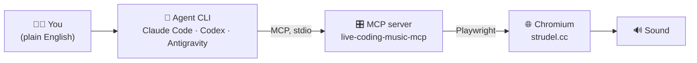

# Strudel MCP — Teaching Demo

Connecting an **MCP server to agentic coding CLIs**, using [Strudel](https://strudel.cc)
live-coding music as the tangible, audible example: you type a request to an AI agent, and
a browser makes music.

> [!IMPORTANT]
> **The real subject is MCP + agents, not music.** Strudel is the fun vehicle that makes
> the idea click. Same MCP server, three vendors' CLIs — whatever agent a student brings,
> it works.



## Quick start

**Prerequisite: Node.js 22+** (`npm` and `npx` come bundled — nothing extra to install).

| Platform | Get Node 22+ |
| --- | --- |
| **macOS** | `brew install node@22`, or [nvm](https://github.com/nvm-sh/nvm) (`nvm install 22`), or [nodejs.org](https://nodejs.org) |
| **Windows** | Installer from [nodejs.org](https://nodejs.org), or `winget install OpenJS.NodeJS.LTS` |
| **Linux** | [nvm](https://github.com/nvm-sh/nvm), or your distro's package manager |

Check: `node -v` → must be **v22+** (upgrade first if older).

```bash
# 1. Install the MCP server + the browser it drives (once per machine)
npm install -g @williamzujkowski/live-coding-music-mcp@4.0.0
npx playwright install chromium

# 2. Register it with your agent (pick one)
claude mcp add strudel live-coding-music-mcp        # Claude Code
codex mcp add strudel -- live-coding-music-mcp       # Codex
# Antigravity CLI: edit ~/.gemini/config/mcp_config.json (see docs)

# 3. Ask the agent:
#    "Initialize Strudel and play a four-on-the-floor kick."
```

> [!TIP]
> Full per-client instructions (macOS + Windows), troubleshooting, and free options for
> students: **[docs/setup/](docs/setup/)**.

## Where things are

| Path | What |
| --- | --- |
| [`CLAUDE.md`](CLAUDE.md) / [`AGENTS.md`](AGENTS.md) | Durable project facts — read first |
| [`docs/setup/`](docs/setup/) | Per-client setup guides · cross-platform summary · recovery playbook · free options |
| [`docs/strudel/`](docs/strudel/) | Strudel primer + tested demo patterns + live script |
| [`docs/prd/`](docs/prd/) | Product requirements (the plan) |
| [`logs/`](logs/) | Running logs: install steps, TODO, costs/quota, meeting notes |

## Status (updated 2026-08-18)

| Piece | State |
| --- | --- |
| MCP server v4.0.0 + Chromium installed | ✅ on this Mac |
| Audio proven end-to-end (Claude Code) | ✅ `analyze` confirmed sound |
| Claude Code | ✅ connected |
| Codex | ✅ registered — live audio pending |
| Antigravity CLI (`agy`, free Google client) | ✅ tools listed — live audio pending |
| Strudel knowledge base | ✅ primer + 5 tested patterns |
| Windows setup | ✍️ documented, **dry-run pending** |
| Workshop format | ✅ decided: hands-on, missions + showcase (2026-08-18) |
| Rehearsal + recovery playbook | ⬜ stub created, to fill during testing |

> [!NOTE]
> **Three facts to remember**
>
> 1. Strudel makes sound **only in a browser** (Web Audio) — the server drives a *visible*
>    Chromium window on purpose.
> 2. The same stdio command works for **every** MCP client.
> 3. Each client spawns its **own** server + browser → run **one client at a time**.
