# Run of Show — what you actually do

Two hours. Print this or keep it on a second screen.

```mermaid
gantt
    dateFormat mm
    axisFormat %M
    title The two hours
    section Session
    Straggler fix       :00, 15m
    Strudel — one idea  :15, 20m
    Agent + MCP + limits:35, 10m
    Reggae demo (live)  :45, 15m
    Open exploration    :60, 45m
    Showcase            :105, 15m
```

---

## Before the day

### T−7 days — send the pre-work email

Source: [`student/pre-work-email.md`](student/pre-work-email.md). Before you send it:

- [ ] FHNW has confirmed **which agent** students get, and accounts exist
- [ ] `START-HERE.md` is published at a URL that opens **without a GitHub account**
- [x] Windows smoke-test done (2026-08-24) — install, registration, and MAKE prompts work

### T−1 day

- [ ] Send the short follow-up ("did it work? come anyway if not")
- [ ] Your own dress rehearsal is done — see [`rehearsal.md`](rehearsal.md)
- [ ] Deck built offline (`cd slides && npm run build`)
- [ ] Room speaker confirmed for the showcase

### Morning of

- [ ] Arrive early. Open strudel.cc on the presenter machine and **play every sound in the
      demo** while the wifi is good — samples only cache once actually played
- [ ] One agent running, one Chromium window. Quit everything else
- [ ] Volume tested at room level, then turned down
- [ ] `slides/dist` open in a browser (not the dev server — one less thing to break)
- [ ] YouTube slide loads (needs network) — decide now whether you have a local backup

---

## 0:00–0:15 — Straggler fix

**Don't teach yet.** Walk the room. Ask everyone to run their check:

> Initialize Strudel and play a four-on-the-floor kick.

Triage in this order — most problems are the first two:

| Symptom | Fix |
| --- | --- |
| No sound, browser open | **Click inside the browser window.** Then check volume/output device |
| Code changed, music didn't | Press **`update`** top-right in strudel.cc |
| Server not connected | Restart the agent — tools load at session start |
| Windows: won't start / times out | Re-register with the absolute-`node` form ([codex.md](setup/codex.md) / [claude-code.md](setup/claude-code.md)) |
| Nothing installed at all | **Pair them with a neighbour.** Two people on one laptop is a fine creative setup — don't let one person's install eat your session |

Full table: [`setup/recovery-playbook.md`](setup/recovery-playbook.md).

**Announce the ending now:** *"Last 15 minutes, anyone who wants to plays 30 seconds out
loud. Optional. But it's the best part."* This is what gives the free hour a shape.

---

## 0:15–0:35 — Strudel: one idea

Follow [`strudel/primer.md` Part 1](strudel/primer.md#part-1--the-15-minute-arc). Deck
slides 4–14.

0. **Show the destination first** — ~60–90 sec of
   [2 Minute Deep Acid in Strudel](https://www.youtube.com/watch?v=HkgV_-nJOuE) (deck slide
   5). Not the whole thing. Point out one thing: he adds one layer at a time.
   ⚠️ needs network — skip it rather than fight dead wifi.
1. **Make a noise before explaining anything.** `sound("bd*4")`, Ctrl+Enter.
2. **The cycle.** Build it up line by line, playing each. The move that lands it: ask
   *"what happens if I add one more thing?"* **before** you do it.
3. **`stack()`.** Add one line at a time. Three lines and it's music.
4. **One knob** — `.gain()`. Mention the others exist; don't demo them.
5. **Hand over.** Live: *"Explain what `sound("hh*8").gain(0.4)` does."* / *"How do I add
   reverb?"*

> ⚠️ On the live-Strudel slides your **clicker will not work**. Click the text column to get
> arrow keys back, or advance with the mouse.

**Do not teach:** `note()`, scales, signals, tempo, effects. They're one question away.

---

## 0:35–0:45 — Agent + MCP + the limit

Deck slides 15–23.

1. **The diagram.** You → agent → MCP → browser → sound. *"MCP is the middle arrow: a
   standard way to let an agent reach a piece of software."*
2. **The bridge:** *"The Blender session is the same picture with a different box at the
   end."*
3. **Three levels.** Reads code ✅ · Measures the sound ✅ · Judges it ❌
4. **You are the ears.** Describe, don't evaluate.

---

## 0:45–1:00 — The reggae demo

Full script, including what to say in every pause:
**[`strudel/demo-reggae.md`](strudel/demo-reggae.md)**

Switch to your agent window — the MCP drives its own browser, not the deck's iframe.

The three beats that matter:
- **The one drop** — the kick is on 3, beat 1 is a hole. Count it out loud.
- **The skank** — mute it, play just drums, bring it back. Ask which one is reggae.
- **Step 6** — type *"that sounds bad, fix it"*, let it flounder, then show the good
  version. **Do not skip this.** It's the most useful 90 seconds of the session.

If it stalls: paste a fallback, say *"I'll take this one"*, keep talking. Nobody notices.

---

## 1:00–1:45 — Open exploration

Say: *"Now do that with a genre you care about."* Put [`strudel/prompts.md`](strudel/prompts.md)
on screen (deck slides 26–29) and get out of the way.

**Circulate.** What you're looking for:

| You see | You say |
| --- | --- |
| Staring at a blank prompt | Hand them a seed. *"Two artists you like — collide them."* |
| Asking for finished tracks | *"Try: ask it for three options and pick one."* |
| Saying "it sounds bad" | *"Tell it **what** you heard. Busy? Muddy? Too fast?"* |
| Something good | **"Copy that URL right now."** |
| Bored | Escalate: *"Make it get gradually stranger over two minutes."* |
| Curious about the plumbing | `npx @modelcontextprotocol/inspector live-coding-music-mcp` — show them the raw tool list, let them find one nobody used |

**Around 1:35, give a five-minute warning** so people have something to play.

---

## 1:45–2:00 — Showcase

- Headphones off. Room speaker on.
- Volunteers only. ~30 seconds each. Don't push anyone.
- **The closing observation:** everyone started from the same handful of seeds and nothing
  sounds alike. That's the point.
- Then the last slide: *"You just pointed an AI agent at software you'd never used, and made
  it do something real. That was MCP. What would you point it at?"*

---

## Afterwards

- [ ] Note what broke, in [`setup/recovery-playbook.md`](setup/recovery-playbook.md)
- [ ] Note which prompts landed and which fell flat, in [`strudel/prompts.md`](strudel/prompts.md)
- [ ] Note actual timings against this plan
