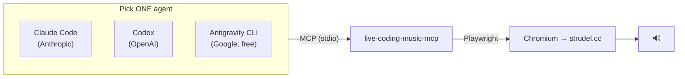

# Setup Guides

Connect the **Strudel live-coding MCP server** to an agentic CLI. This is the practical
core of the student session.

## The big idea

You run a small local program (the **MCP server**). Your AI agent talks to it over the
MCP protocol. The server drives a real **Chromium browser** pointed at
[strudel.cc](https://strudel.cc/) — typing music code and pressing play. Ask the agent for
"a techno beat" and a browser window makes actual sound.



> [!IMPORTANT]
> **Same server, three different agents.** Only the *way you register the server* differs.
> That interchangeability is the whole MCP lesson.

## Step 1 — Prerequisites (all clients)

| Need | Why | Check |
| --- | --- | --- |
| **Node.js 22+**, npm 10+ | runs the MCP server | `node -v` |
| **Speakers / headphones** | to hear it | — |
| Internet (first run) | loads strudel.cc | works offline after first load (PWA) |

## Step 2 — One-time install (once per machine)

```bash
npm install -g @williamzujkowski/live-coding-music-mcp@4.0.0
npx playwright install chromium
```

> [!NOTE]
> The Playwright step prints an *"install your project's dependencies first"* warning.
> **Ignore it** — Chromium still downloads. Expected for a globally-installed tool.

## Step 3 — Pick your agent

| Vendor | Guide | Status |
| --- | --- | --- |
| Anthropic | **[Claude Code](./claude-code.md)** | ✅ verified, audio proven |
| OpenAI | **[Codex](./codex.md)** | ✅ registered — live audio pending |
| Google | **[Antigravity CLI](./antigravity-cli.md)** | ✅ tools listed — live audio pending |
| ~~Google~~ | [Gemini CLI](./gemini-cli.md) | ⚠️ deprecated for free accounts (2026-06-18) |

More references:

- 📋 **[service-setup-summary.md](./service-setup-summary.md)** — every service, macOS +
  Windows, on one page (includes the Windows `cmd /c` gotcha).
- 🆓 **[free-and-local-options.md](./free-and-local-options.md)** — three €0 ways to drive
  the same server (hosted free tier, local models via Ollama / LM Studio).
- 🚑 **[recovery-playbook.md](./recovery-playbook.md)** — "if X breaks live → do Y".

## Good to know

> [!WARNING]
> - Each agent starts its **own** server + **own** Chromium window → run **one agent at a
>   time**.
> - The browser window is **visible on purpose** — you see the code, you hear the result.
>   Don't run headless.
> - The server is **experimental**. It works, but rehearse before presenting.
