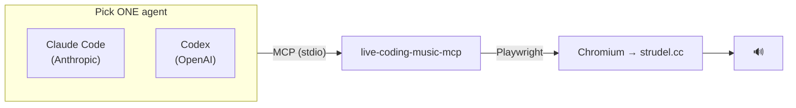
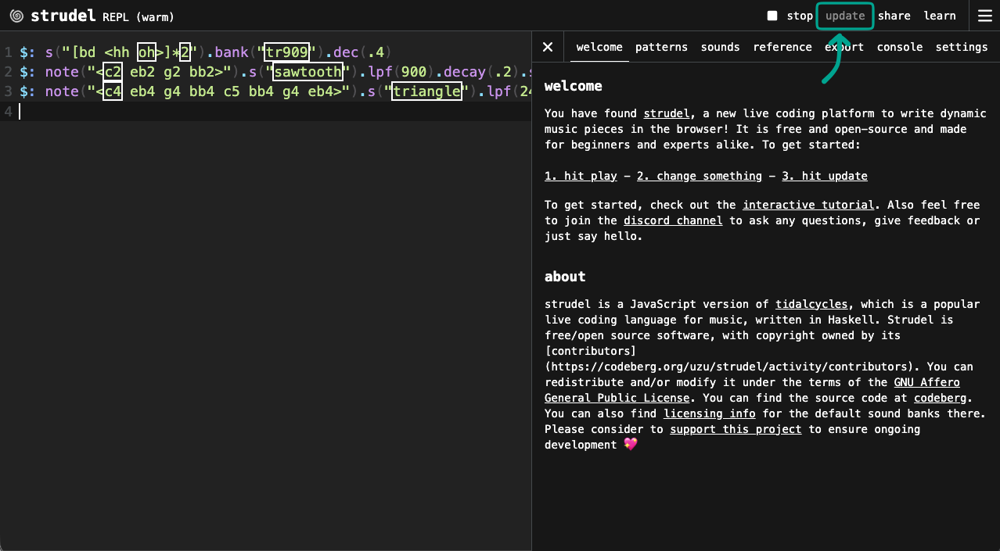

# Setup Guides

Connect the **Strudel live-coding MCP server** to an agentic CLI. This is the practical
core of the student session.

## The big idea

You run a small local program (the **MCP server**). Your AI agent talks to it over the
MCP protocol. The server drives a real **Chromium browser** pointed at
[strudel.cc](https://strudel.cc/) — typing music code and pressing play. Ask the agent for
"a techno beat" and a browser window makes actual sound.



> [!IMPORTANT]
> **Same server, different agents. The server does not care which one you use** — only the
> *way you register it* differs. That interchangeability is the MCP lesson, and it's why
> the same idea works on Blender tomorrow.

> [!TIP]
> **Students should start at [`../student/START-HERE.md`](../student/START-HERE.md)** —
> one page, no jargon. The guides here are the detailed reference behind it.

## Step 1 — Prerequisites (all clients)

| Need | Why | Check / install |
| --- | --- | --- |
| **Node.js 22+**, npm 10+ | runs the MCP server | `node -v` |
| **Claude Code** or **Codex** CLI | the agent that talks to the server | [Claude Code install](https://docs.anthropic.com/en/docs/claude-code/installation) · [Codex install](https://github.com/openai/codex) — then `claude --version` or `codex --version` |
| **Speakers / headphones** | to hear it | — |
| Internet (first run) | loads strudel.cc | works offline after first load (PWA) |

## Step 2 — One-time install (once per machine)

```bash
npm install -g @williamzujkowski/live-coding-music-mcp@4.0.0
```

> [!TIP]
> **The browser install is optional.** The MCP server usually downloads Chromium
> automatically the first time it runs. Only run the line below if the agent complains that
> the browser is missing.
>
> ```bash
> # use the server's OWN bundled playwright CLI, and skip the headless shell
> node "$(npm root -g)/@williamzujkowski/live-coding-music-mcp/node_modules/playwright/cli.js" install chromium --no-shell
> ```
>
> **Why not `npx playwright install chromium`?** Two reasons, both measured (2026-08-20):
> 1. The server depends on `playwright@^1.52.0` — a **floating** range. `npx playwright`
>    resolves independently, so it can download a *different* browser revision than the one
>    the server then looks for, and the server fails with a missing-browser error.
>    The bundled CLI always matches.
> 2. `npx playwright` also pulls a second ~45 MB copy of playwright into `~/.npm/_npx`.
>
> **`--no-shell`** skips the headless shell: **−95 MB on macOS, −115 MB on Windows.** Safe
> only because we run headed. If anyone ever sets `config.json → headless: true`, this
> breaks.
>
> The Playwright step prints an *"install your project's dependencies first"* warning.
> **Ignore it** — Chromium still downloads. Expected for a globally-installed tool.

## Step 3 — Pick your agent

Two supported clients (narrowed 2026-08-20 — FHNW funds the plans, so students no longer
arrive with whatever free tier they happened to have).

| Vendor | Guide | Status |
| --- | --- | --- |
| Anthropic | **[Claude Code](./claude-code.md)** | ✅ verified, audio proven |
| OpenAI | **[Codex](./codex.md)** | ✅ registered — live audio pending |

Dropped: Antigravity CLI and Gemini CLI → [`archive/`](./archive/).

More references:

- 📋 **[service-setup-summary.md](./service-setup-summary.md)** — both clients, macOS +
  Windows, on one page (includes the Windows registration gotcha).
- 🚑 **[recovery-playbook.md](./recovery-playbook.md)** — "if X breaks live → do Y".

## Good to know

> [!TIP]
> **Code changed but the music didn't?** The agent edits the code in the browser, but
> sometimes the new version isn't applied to the audio automatically. Press **`update`**
> (top right of the strudel.cc window, or Ctrl/Cmd+Enter in the editor) to make the
> current code audible:
>
> 

> [!WARNING]
> - Each agent starts its **own** server + **own** Chromium window → run **one agent at a
>   time**.
> - The browser window is **visible on purpose** — you see the code, you hear the result.
>   Don't run headless.
> - The server is **experimental**. It works, but rehearse before presenting.
