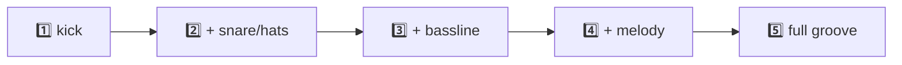

# Demo Patterns (tested)

A 5-step arc that builds a track from one kick to a full groove. Each step is a small,
narratable change — perfect for "watch the agent add one layer at a time."



> [!NOTE]
> **Validation key:** ✅local = passed `validate_pattern_local` · ✅runtime = passed
> `validate_pattern_runtime` (real strudel.cc) · 🔊played = actually played and confirmed
> audible via `analyze` (2026-07-01).

Paste any of these into <https://strudel.cc> (Ctrl/Cmd+Enter to play, Ctrl/Cmd+. to stop),
or ask the agent for them by description.

---

## 1 — One kick (the "hello world")  ✅local
```js
sound("bd*4")
```
Talking point: four-on-the-floor. The whole quoted string is one looping cycle.

## 2 — A basic beat  ✅local 🔊played
```js
stack(
  sound("bd*4"),
  sound("~ sd ~ sd"),
  sound("hh*8").gain(0.4)
)
```
Talking point: `stack` = layers at once. Snare on 2 & 4, quieter hats. This is the one we
confirmed makes real sound through the MCP chain.

## 3 — Add a bassline  ✅local
```js
stack(
  sound("bd*4"),
  sound("~ sd ~ sd"),
  sound("hh*8").gain(0.4),
  note("c2 ~ c2 g1").sound("sawtooth").lpf(600)
)
```
Talking point: `note()` for pitch, `.sound("sawtooth")` for a synth voice, `.lpf(600)` to
tame the brightness.

## 4 — A melodic line with a scale  ✅runtime
```js
stack(
  sound("bd*4"),
  sound("hh*8").gain(0.4),
  n("0 2 4 6 4 2").scale("C:minor").sound("triangle").delay(0.4).room(0.3)
)
```
Talking point: scale degrees + `.scale()` = melody without music theory. Add `.delay`/`.room`
for space.
> Note: fails the *local* validator (no `.scale`), works on real strudel.cc. See primer.

**Explicit-notes fallback** (if you want something that also passes local validation) ✅local:
```js
stack(
  sound("bd*4"),
  sound("hh*8").gain(0.4),
  note("c4 eb4 g4 bb4 g4 eb4").sound("triangle").delay(0.4).room(0.3)
)
```

## 5 — Full groove (the "wow")  ✅local
```js
stack(
  sound("bd(3,8)"),
  sound("~ cp").room(0.2),
  sound("hh*16").gain(saw.range(0.2, 0.6)),
  note("<c2 eb2 g1 f2>").sound("sawtooth").lpf(sine.range(300, 1200).slow(4))
)
```
Talking point: Euclidean kick `bd(3,8)`, a clap with reverb, hats that swell (`saw.range`),
and a bass whose filter slowly opens (`sine.range(...).slow(4)`). Try `setcpm(130)` on top.

---

## Suggested live script (the story)

1. "Initialize Strudel." → browser opens.
2. "Play a four-on-the-floor kick." → pattern 1.
3. "Add a snare on 2 and 4, and some hi-hats." → pattern 2. *(now it grooves)*
4. "Add a sawtooth bassline." → pattern 3.
5. "Give me a minor-key melody with some reverb." → pattern 4.
6. "Make it a full techno groove and set the tempo to 130." → pattern 5.
7. "Stop." → silence. Take a bow.

Each step is one sentence to the agent → one audible change. That *is* the MCP lesson.
