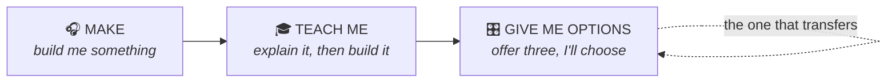

# Prompt Library — three ways to talk to your agent

You have an AI agent that can write and play music for you. Most people only ever use it
one way: *"make me a techno track."* That works, and it gets boring in about ten minutes.

There are three moves. Learn all three and you'll still be using them tomorrow, on
completely different software.

---

## Mode 1 — MAKE

The obvious one. You describe, it builds. Good for getting off a blank page fast.

The trick is to be **specific and ambitious**. "Make music" gets you mush. "Make a
slow, dubby reggae track with a heavy offbeat guitar and a bassline that leaves lots of
space" gets you something.

Copy any of these:

> Build me a **reggae** track. Slow, heavy bass, guitar on the offbeat.

> Build me a **trip-hop** track — dusty drums, slow tempo, something melancholy on top.

> Make something that sounds like **two of my favourite artists collided**: [artist A]
> and [artist B]. Tell me what you think each one contributes.

> Start with just a kick drum. Then **add one instrument at a time** — I'll tell you when
> to add the next one.

> Build a track that **gradually gets stranger over two minutes**: start completely
> normal, end somewhere I wouldn't have predicted.

> Give me **three versions of the same track** with three different moods: one hopeful,
> one anxious, one exhausted. Same tempo, same key.

---

## Mode 2 — TEACH ME

This is the one nobody thinks of, and it's why you don't need to memorise anything.

Your agent knows Strudel and it knows music. You can ask it to **explain before it
builds** — which means you learn the thing while you make the thing.

### Teach me the software

> How do I add **reverb** in Strudel?

> **Explain what this line does**, piece by piece: `sound("bd(3,8)").room(0.3)`

> I want the kick to play **four times per bar**. Show me how, and explain the syntax so I
> can do it myself next time.

> What are **three different ways** I could make this rhythm less repetitive? Explain what
> each one does before you change anything.

> **Teach me the Strudel commands I need** to understand the code you just wrote.

### Teach me the music

> I recognise **reggae** when I hear it but I don't know what actually defines it. Explain
> the main rhythmic and instrumental characteristics — then help me reproduce them.

> What's the difference between **house and techno**? Show me by building a short example
> of each.

> What makes a track sound **sad**? Is it the key, the tempo, the instruments, or something
> else? Demonstrate.

> Explain **song structure** — intro, verse, chorus, breakdown. Then help me give this loop
> an actual arrangement.

> Why does this sound **muddy**? Explain what's happening in the frequency range and what
> producers normally do about it.

---

## Mode 3 — GIVE ME OPTIONS

**This is the important one.** It turns the agent from a vending machine into a
collaborator — and it's the move that works on any software an agent can reach, not just
this one.

Instead of asking for a finished thing, ask for **choices with explanations**, and keep
the decisions yourself.

> Help me improve this track. At each step, give me **three possible changes**, explain
> what each would do musically, and **let me choose** before you continue.

> Help me create a reggae track. Build it **one instrument at a time**. Before adding each
> instrument, explain what role it usually plays in reggae and what makes the rhythm
> characteristic. Give me the code for each step and **wait for me** before continuing.

> This is currently a trip-hop track. Help me **gradually transform it into trance**.
> Explain which musical characteristics have to change, then change them step by step —
> one at a time, so I can hear each one.

> Take this happy track and make it **dark**. But first tell me what you're going to change
> and why. Then do it in three stages so I can hear where it tips over.

> I like this but something's off and I can't say what. Ask me **questions** until you work
> out what's bothering me, then propose fixes.

> Act as my **producer**. I'll play you what I have; you tell me what you'd change and why.
> Don't change anything until I agree.

---

## The thing you must know: your agent cannot hear it

This matters more than any prompt above.

| What it can do | How |
| --- | --- |
| ✅ **Read** your code | Perfectly. It wrote most of it. |
| ✅ **Measure** the output | It has tools that report *is it playing, how loud, where's the energy* |
| ❌ **Judge** whether it sounds good | It has no ears and no taste |

So this is a wasted message:

> ❌ *"That sounds bad. Fix it."*

It genuinely doesn't know what you heard. **You are the ears.** Describe, don't evaluate:

> ✅ "The drums feel too busy."
> ✅ "The bass is drowning out the melody."
> ✅ "I want it slower and darker."
> ✅ "The transition is too abrupt — it needs something in between."
> ✅ "It's fine but it's boring after 8 bars."

The more specific your description, the better the fix. This is a real skill, and it's the
same skill whether you're directing an agent making music, editing an image, or moving
something in Blender.

---

## Save your work

Strudel encodes your whole pattern **into the page URL**. So:

> **When you make something you like, copy the URL and paste it somewhere** — notes app,
> a message to yourself, anywhere. That URL replays your track exactly.

Do it *before* you keep editing. There is no undo across a page refresh.

You can also just ask:

> Save this version as "reggae-v2" so I can come back to it.

---

## If you only remember one prompt

> I want to understand **reggae**. Teach me its important musical characteristics and help
> me make a reggae track in Strudel. Let's build it **instrument by instrument**. Explain
> each decision and the relevant Strudel commands as we go, and **wait for me** before
> adding the next layer.

That's all three modes at once: it makes something, it teaches you the music *and* the
software, and it keeps you in the driver's seat.

Swap "reggae" for anything.
