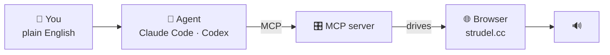

# Making Music<br>by Asking For It

**Exploration Week** · Strudel + AI agents

<div class="pt-12 opacity-60 text-sm">
You will type in plain English. A browser will make music.
</div>

---
layout: statement
---

# You can't direct an AI well<br>in something you understand *nothing* about

<div class="pt-8 text-lg opacity-70">

So today is **not** "here's a magic button."

It's: learn *just enough* about the thing you're making,<br>
so you can actually tell the agent what you want.

</div>

<!--
This is the whole session in one line. Say it, let it sit, move on.
The Blender people are learning the same lesson with a different toy.
-->

---

# Today

<div class="grid grid-cols-2 gap-8 pt-4">
<div>

**~20 min** — What Strudel is. One idea.

**~10 min** — How the agent reaches it. What it can't do.

**~15 min** — I build a reggae track by asking to be taught one.

**The rest** — You make something.

**Last 15 min** — Anyone who wants to, plays it out loud.

</div>
<div class="opacity-70 text-sm pt-2">

Rules:

- 🎧 Headphones on, except at the end
- 💾 When you like it, **copy the URL**
- 🙋 I'm circulating — grab me

</div>
</div>

---
layout: section
---

# 1 · Strudel

Live-coding music in a browser

---
layout: center
class: text-center
---

# This is where we're going

<Youtube id="HkgV_-nJOuE" width="720" height="405" />

<div class="pt-4 opacity-70 text-sm">
"2 Minute Deep Acid in Strudel (from scratch)" — Switch Angel
</div>

<!--
Play ~60-90 seconds. Don't play all of it.

Say: "Nothing was there when this started. Every line you see appear is making a
sound the moment it's typed. You are not going to be this fast today — but you
will understand what he's doing by the end of the next 20 minutes."

Point out ONE thing: he adds one layer at a time. That's stack(), which is the
second thing I teach.

⚠️ NEEDS NETWORK. If the wifi is dead, skip it — don't fight it on stage.
Have the file downloaded locally as a backup if you want insurance.
-->

---
layout: iframe-right
url: https://strudel.cc/
---

# Type. Press Start.

<div class="pt-4">

Click **Start** to play.

Change something, then click **Update** to hear it.

Click **Stop** when you want silence.

</div>

<div class="pt-8 text-sm opacity-70">

That's the entire interface.

</div>

<details class="pt-8 text-sm opacity-80 text-left">
  <summary class="cursor-pointer font-semibold">What do these letters and labels mean?</summary>
  <div class="pt-3 space-y-1">
    <ul class="list-disc pl-5 space-y-1">
      <li><b>BANK</b> — the menu that picks which set of sounds to use.</li>
      <li><b>TR-909</b> — a classic Roland drum machine; the default electronic drum sound.</li>
      <li><b>BD</b> — bass drum / kick.</li>
      <li><b>SD</b> — snare drum.</li>
      <li><b>HH</b> — closed hi-hat.</li>
      <li><b>OH</b> — open hi-hat.</li>
      <li><b>CP</b> — clap.</li>
      <li><b>sound("...")</b> — the function that turns the pattern into sound.</li>
    </ul>
  </div>
</details>

<!--
⚠️ NAVIGATION: your clicker will NOT work while focus is in the Strudel iframe.
Click THIS column (the text side) to get arrow keys back, or click the on-screen arrows.

Do this: type sound("bd*4") into the REPL on the right, then click Start.
Make a noise BEFORE explaining anything. Then click Stop.
-->

---
layout: statement
---

# Anything in quotes is a pattern<br>that fills **one loop**

<div class="pt-6 text-lg opacity-70">
Whatever you put in it splits that loop evenly.
</div>

---

# Build it up

```js
sound("bd")           // one kick, filling the whole loop
```

```js
sound("bd sd")        // kick then snare — half the loop each
```

```js
sound("bd sd hh cp")  // four things — a quarter each
```

```js
sound("bd*4")         // shorthand: kick, four times
```

```js
sound("bd ~ sd ~")    // ~ is a rest. Silence takes a slot too.
```

<div v-click class="pt-6 text-xl">

**Add one more thing and everything gets faster.**<br>
<span class="opacity-70 text-base">Because it still has to fit in the same loop.</span>

</div>

<StrudelPad preset="basics" />

<details class="pt-4 text-sm opacity-80 text-left">
  <summary class="cursor-pointer font-semibold">What do these mean?</summary>
  <div class="pt-3 space-y-1">
    <ul class="list-disc pl-5 space-y-1">
      <li><b>bd</b> — bass drum / kick.</li>
      <li><b>sd</b> — snare drum.</li>
      <li><b>hh</b> — hi-hat.</li>
      <li><b>cp</b> — clap.</li>
      <li><b>*4</b> — play four times inside one loop.</li>
      <li><b>~</b> — rest: silence that still takes up a slot.</li>
      <li><b>sound("...")</b> — the function that turns the pattern into a sound.</li>
    </ul>
  </div>
</details>

<!--
Play each one from the pad, in order. Ask "what happens if I add one more?"
BEFORE you click the next chip. That question is the whole lesson.

The pad is live — after the last chip, TYPE a fifth thing into it in front of them
and watch the loop speed up. That's the point landing.
-->

---

# Two more

```js
sound("[bd sd] hh")   // brackets = a group squeezed into one slot
```

```js
sound("bd(3,8)")      // 3 hits spread evenly over 8 slots
```

<div class="pt-8 opacity-70">

Don't worry about the second one. Just know that<br>
**"3 hits spread over 8 slots" is how half of all dance music is built.**

</div>

<StrudelPad preset="more" />

<details class="pt-4 text-sm opacity-80 text-left">
  <summary class="cursor-pointer font-semibold">What do these mean?</summary>
  <div class="pt-3 space-y-1">
    <ul class="list-disc pl-5 space-y-1">
      <li><b>[ bd sd ]</b> — brackets squeeze two sounds into one slot.</li>
      <li><b>(3,8)</b> — Euclidean rhythm: 3 hits spread evenly over 8 slots.</li>
      <li><b>(5,8)</b> — same idea, 5 hits over 8 slots — a busier groove.</li>
      <li><b>stack(...)</b> — layer multiple patterns so they play at the same time.</li>
      <li><b>.gain(0.4)</b> — make that pattern quieter (40% volume).</li>
    </ul>
  </div>
</details>

<!--
bd(3,8) then bd(5,8) back to back — same idea, different feel. Don't explain the
maths; let them hear that one number changed the groove.
-->

---

# Layers

`stack()` plays patterns at the same time. That's how a track is built.

```js
stack(
  sound("bd*4"),        // kick
  sound("~ sd ~ sd"),   // snare on 2 and 4
  sound("hh*8")         // hats
)
```

<div v-click class="pt-6 text-xl">

Three lines. That's music.

</div>

<StrudelPad preset="layers" />

<details class="pt-4 text-sm opacity-80 text-left">
  <summary class="cursor-pointer font-semibold">What do these mean?</summary>
  <div class="pt-3 space-y-1">
    <ul class="list-disc pl-5 space-y-1">
      <li><b>stack(...)</b> — plays all the patterns inside it at the same time.</li>
      <li><b>bd*4</b> — kick drum, four times per loop.</li>
      <li><b>~ sd ~ sd</b> — rest, snare, rest, snare — snare on beats 2 and 4.</li>
      <li><b>hh*8</b> — hi-hat, eight times per loop.</li>
    </ul>
  </div>
</details>

<!--
Click the chips left to right, letting each one loop for a few seconds. This is the
"room leans in" moment — don't rush it, and don't talk over the third click.
-->

---

# One knob

A `.something()` on the end changes how it sounds.

```js
stack(
  sound("bd*4"),
  sound("~ sd ~ sd"),
  sound("hh*8").gain(0.4)   // ← hats were too loud
)
```

<div v-click class="pt-6">

There are dozens more — `.room()` reverb, `.lpf()` darker, `.delay()` echo.

**You will never memorise them. You don't have to.**

</div>

<StrudelPad preset="knob" />

<details class="pt-4 text-sm opacity-80 text-left">
  <summary class="cursor-pointer font-semibold">What do these mean?</summary>
  <div class="pt-3 space-y-1">
    <ul class="list-disc pl-5 space-y-1">
      <li><b>.gain(0.4)</b> — set the volume to 40% (quieter).</li>
      <li><b>.room(0.5)</b> — add reverb, as if the sound is in a room.</li>
      <li><b>.lpf(500)</b> — low-pass filter: only frequencies below 500 Hz get through (darker sound).</li>
      <li><b>stack(...)</b> — layer patterns so they play together.</li>
    </ul>
  </div>
</details>

<!--
First two chips back to back = the whole slide. The room hears one number fix a mix.
Then .room() and .lpf() only if you have time — they're the "dozens more" made real.
-->

---
layout: statement
---

# That's everything<br>I'm going to teach you about Strudel

<div class="pt-8 text-lg opacity-70">
From here, you ask the agent.<br>
Including asking it to <b>teach you</b>.
</div>

<!--
Live, in front of them:
  "Explain what sound('hh*8').gain(0.4) does, line by line."
  "How do I add reverb?"
This transition IS the lesson.
-->

---
layout: section
---

# 2 · How the agent reaches it

...and what it can't do

---

# What's actually happening



<div v-click class="pt-8">

**MCP** is the middle arrow: a standard way to let an agent *reach a piece of software*.

</div>

<div v-click class="pt-4 text-lg">

Which is why it matters beyond today — **the Blender session is the same picture**,
with a different box at the end.

</div>

---
layout: statement
---

# Can it hear the music?

---

# Three levels

<div class="grid grid-cols-3 gap-4 pt-8">

<div class="p-4 rounded border border-green-500/40">
<div class="text-3xl">✅</div>
<div class="text-xl pt-2 font-bold">Reads your code</div>
<div class="opacity-70 pt-2 text-sm">Perfectly. It wrote most of it.</div>
</div>

<div class="p-4 rounded border border-green-500/40">
<div class="text-3xl">✅</div>
<div class="text-xl pt-2 font-bold">Measures the sound</div>
<div class="opacity-70 pt-2 text-sm">Is it playing? How loud? Where's the energy?</div>
</div>

<div class="p-4 rounded border border-red-500/40">
<div class="text-3xl">❌</div>
<div class="text-xl pt-2 font-bold">Judges it</div>
<div class="opacity-70 pt-2 text-sm">No ears. No taste. None.</div>
</div>

</div>

<div v-click class="pt-10 text-center text-2xl">

**So you are the ears.**

</div>

---

# Describe. Don't evaluate.

<div class="grid grid-cols-2 gap-8 pt-6">
<div>

### ❌ Wasted

> "That sounds bad. Fix it."

<div class="pt-4 opacity-70 text-sm">
It genuinely has no idea what you heard.
</div>

</div>
<div>

### ✅ Works

> "The drums feel too busy."

> "The bass is drowning the melody."

> "I want it slower and darker."

> "It gets boring after 8 bars."

</div>
</div>

<div v-click class="pt-8 text-center text-lg opacity-80">

Same skill in Blender. It can't see your render either.

</div>

---
layout: section
---

# 3 · Watch this

I don't know how to make reggae

<!--
SWITCH TO THE AGENT WINDOW. The MCP drives its own browser — not this deck.

Prompt:
  "I want to understand reggae. Teach me its important musical characteristics,
   and help me build a reggae track in Strudel. Build it one instrument at a time.
   Before you add each instrument, explain what role it plays in reggae and what
   makes it characteristic. Give me the code for each step and wait for me
   before continuing."

Full script + fallback patterns: docs/strudel/demo-reggae.md
Talk while it thinks. The latency is the teaching slot.
-->

---
layout: section
---

# 4 · Your turn

---

# Three ways to talk to it

<div class="pt-4 space-y-6">

<div class="p-4 rounded bg-gray-500/10">
<div class="text-xl">🎧 <b>MAKE</b></div>
<div class="opacity-80 pt-1">"Build me a reggae track — slow, heavy bass, guitar on the offbeat."</div>
</div>

<div class="p-4 rounded bg-gray-500/10">
<div class="text-xl">🎓 <b>TEACH ME</b></div>
<div class="opacity-80 pt-1">"I recognise reggae but don't know what defines it. Explain it, then help me build it."</div>
</div>

<div class="p-4 rounded bg-blue-500/15 border border-blue-500/40">
<div class="text-xl">🎛️ <b>GIVE ME OPTIONS</b></div>
<div class="opacity-80 pt-1">"At each step, offer me three changes, explain what each does musically, and wait for me to pick."</div>
</div>

</div>

<div v-click class="pt-6 text-center">

The third one is the one that's still useful tomorrow.

</div>

---

# Keep these questions with you

<div class="pt-2 text-lg opacity-80">
While you make your track, notice who is making the decisions.
</div>

<div class="grid grid-cols-2 gap-8 pt-6 text-sm">
<div class="space-y-3">

### Is it yours?

> When you finish, whose track will it be — **yours**, **its**, or **both**?

> Notice one thing in it that was **your** decision.

> Could you explain **one line** of it to the person next to you?

</div>
<div class="space-y-3">

### Would you sign it?

> Would you put your name on it and show it to someone?

> If yes — what will make it yours?<br>
> If no — what will be missing?

</div>
</div>

<div v-click class="pt-8 text-center opacity-70">

There's no right answer. **"It's mostly the agent's"** is a real answer.

</div>

<!--
Show this immediately before open exploration. Don't ask for answers yet — these are
questions to carry into the work. Say: "Notice your answers while you make something."

During the showcase, listen for people who cannot name a single decision of their own.
That's the thesis of the whole week, live in the room.
-->

---

# Notice how it feels

<div class="grid grid-cols-2 gap-8 pt-4 text-sm">
<div class="space-y-3">

### While you work

> Does it feel like **playing**, or like **waiting**?

> When do you feel most **in control**? When least?

> Does it hand you something you **didn't expect** and like?

> If you get **bored**, what are you doing?

</div>
<div class="space-y-3">

### The directing

> What does it get **wrong** — and can you tell that it has?

> Do you accept anything you **don't understand**?

> What do you ask for **differently** next time?

</div>
</div>

<div v-click class="pt-6 text-center text-xl">

Same questions at the Blender station. Bring your answers.

</div>

<!--
Point out two or three questions; don't march through all seven and don't collect answers.
They are lenses for the next part, not a reflection exercise afterwards.

"If you get bored, what are you doing?" is the honest one — it tells you whether the
seeds are ambitious enough. Note what you observe while circulating.
-->

---

# If you don't know what to make

<div class="grid grid-cols-2 gap-6 pt-4 text-sm">
<div class="space-y-3">

> Make something that sounds like **two of my favourite artists collided**.

> Start with a kick. Add **one instrument at a time** — I'll say when.

> Build a track that **gets gradually stranger** over two minutes.

</div>
<div class="space-y-3">

> Take this happy track and make it **dark** — in three stages, so I hear it tip over.

> This is trip-hop. **Turn it into trance**, step by step, explaining what has to change.

> Give me **three versions** of this: hopeful, anxious, exhausted.

</div>
</div>

<div class="pt-8 text-center opacity-70">
More: <b>docs/strudel/prompts.md</b>
</div>

---
layout: statement
---

# 💾 The URL is the save button

<div class="pt-6 text-lg opacity-80">

Strudel puts your whole track **in the page URL**.

**Copy it. Paste it somewhere.** It replays exactly.

</div>

<div class="pt-8 text-base opacity-60">
Do it whenever you like something — before you keep editing.<br>
There is no undo after a refresh.
</div>

---
layout: iframe-right
url: https://strudel.cc/
---

# Go

<div class="pt-6 text-lg">

Make something.

I'm circulating — grab me.

</div>

<div class="pt-10 opacity-70">

**Last 15 minutes:** anyone who wants to plays ~30 seconds out loud.

Completely optional. It's the best part.

</div>

<!--
⚠️ Clicker won't work here either — click this text column before using arrow keys.
Leave this slide up while you circulate.
-->

---
layout: center
class: text-center
---

# One last thing

<div class="pt-6 text-xl opacity-80">

You just pointed an AI agent at a piece of software you'd never used,<br>
and made it do something real.

</div>

<div v-click class="pt-8 text-2xl">

**That was MCP. It works on almost anything.**

</div>

<div v-click class="pt-6 text-lg opacity-70">

What would *you* point it at?

</div>
